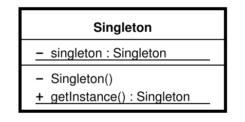

# Padrões de Projeto em Python

Livro: Aprendendo Padrões de Projetos em Python, Autor Chetan Giridhar, 2016

## Conceito de padrões de projeto

São soluções de engenharia de software para determinados problemas que ocorrem comumente em design de software.

Essencialmente, um padrão de projeto diz respeito a aprender com o sucesso de outros.

O interessante é que os padrões de projeto são soluções para problemas conhecidos. Desse modo, eles podem ser muito utilizados na análise ou no design e, conforme esperado, na fase de desenvolvimento, por causa da relação direta com o código da aplicação.

### Características

* São independentes de linguagem e podem ser implementados em linguagens diferentes.
* São dinâmicos, e novos padrões são introduzidos ocasionalmente.
* São passíveis de personalização e, protanto, são úteis aos desenvolvedores.

### Vantagens

* Os padrões  são reutilizáveis em vários projetos.
* Problemas no nível de arquitetura podem ser solucionados.
* Os padrões resistiram ao teste do tempo e sua eficácia foi comprovada, pois incluem a experiência dos desenvolvedores e arquitetos.
* Apresentam confiabilidade e podemos contar com eles.

## Classificação dos padrões

Os 23 padrões apresentados no livro da GoF são classificados em três categorias principais:

* Padrões de criação;
* Padrões estruturais;
* Padrões comportamentais.

A classificação dos padrões é feita principalmente com base na forma como os objetos são criados, as classes e os objetos são estruturados em uma aplicação de software e inclui também a forma como os objetos interagem entre si.

### Padrões de criação

Propriedades dos padrões de criação:

* funcionam com base no modo como os objetos podem ser criados;
* isolam os detalhes da criação dos objetos;
* o código é independente do tipo do objeto a ser criado.

**Exemplo**: Singleton

### Padrões estruturais

Propriedades dos padrões estruturais:

* eles determinam o design da estrutura de objetos e classes para que estes possam ser compostos e resultados mais amplos sejam alcançados;
* o foco está em simplificar a estrutura e identificar o relacionamento entre classes e objetos;
estão centrados em herança e composição de classes.

**Exemplo**: Adapter

### Padrões comportamentais

Propriedades dos padrões comportamentais:

* estão preocupados com a interação entre os objetos e suas responsabilidades;
* os objetos devem ser capazes de interagir e, mesmo assim, devem ter baixo acoplamento.

**Exemplo**: Observer

## Padrões para linguagens dinâmicas

Python é uma linguagem dinâmica e sua natureza pode ser descita da seguinte maneira:

* **Tipos** ou **classes** são **objetos** em tempo de execução.
* As **variáveis** podem ter um **tipo** a partir de um valor inicial e podem ser modificadas em tempo de execução.
* Linguagens dinâmicas têm mais flexibilidade no que diz respeito a restrições de classe.
* O polimorfismo está embutido na linguagem; não há palavras reservadas como **private** e **protected**; e tudo é público por padrão.
* Python representa um caso em que padrões de projeto podem ser facilmente implementados em linguagens dinâmicas.

## Singleton

É um dos padrões de criação mais simples e conhecidos, usado no desenvolvimento de aplicações.

O Singleton proporciona uma forma de ter um e somente um objeto de determinado tipo, além de disponibilizar um ponto de acesso global.

São geralmente usados em casos como logging ou operações de banco de dados, spoolers de impressão e muitos outros cenários em que seja necessário que haja apenas uma instância disponível para toda a aplicação a fim de evitar requisições conflitantes para o mesmo recurso.

### Objetivos

* garantir que um e somente um objeto da classe seja criado;
* oferecer um ponto de acesso para um objeto que seja global no programa;
* controlar o acesso concorrente a recursos compartilhados.

### Diagrama UML

### Implementação

Uma maneira simples de implementar o Singleton é deixar o construtor privado e criar um método estático que faça a inicialização do objeto. Dessa forma, um objeto é criado na primeira chamada e a classe devolverá o mesmo objeto a partir daí.

Em Python, não há opção para criar construtores privados, então precisamos implementar esse padrão de um modo diferente.

#### Singleton clássico em Python

Teremos duas tarefas principais:

1. Permitiremos a criação de apenas uma instância da classe Singleton.
2. Se uma instância já existir, serviremos o mesmo objeto novamente.

O exemplo de implementação deste código está no arquivo: ***/01_singleton/01_classic_singleton.py***

#### Instanciação preguiçosa no padrão Singleton

Um dos casos de uso para o padrão singleton é a instanciação preguiçosa (Lazy Instantiation).

Exemplo, no caso das importações de módulos, podemos acidentalmente criar um objeto mesmo qaundo ele não for necessário. A instanciação preguiçosa garante que o objeto seja criado quando realmente precisamos dele.

Considere a instanciação preguiçosa como uma maneira de trabalhar com recursos reduzidos e criá-los somente quando houver necessidade.

O exemplo de implementação deste código está no arquivo: ***/01_singleton/02_lazy_instantiation_singleton.py***

#### Singleton no nível do módulo

Em Python, todos os módulos são Singletons por padrão devido ao comportamento de importação da linguagem.

Python funciona da seguinte maneira:

1. Ele verifica se um módulo Python foi importado.
2. Em caso afirmativo, devolve o objeto para o módulo. Caso contrário, importa e instancia o módulo.
3. Assim, quando um módulo for importado, ele será inicializado. No entanto, quando o mesmo módulo for importado novamente, ele não será inicializado mais uma vez, o que está relacionado ao comportamente do Singleton, segundo o qual deve haver apenas um objeto e esse mesmo objeto deve ser devolvido.

#### Padrão Singleton Monostate

Segundo Alex Martell, o que um programador geralmente precisa é de instâncias que compartilhem o mesmo estado. Ele sugere que os desenvolvedores devem se preocupar com o estado e o comportamento, e não com a identidade. Como o conceito é baseado no compartilhamento do mesmo estado por todos os objetos, esse padrão também é conhecido como Monostate.

O exemplo de implementação deste código está no arquivo: ***/01_singleton/03_monostate_singleton.py*** e ***/01_singleton/04_monostate_singleton_v2.py***

#### Singleton e metaclasses

Uma metaclasse é uma classe de outra classe, o que significa que a classe é uma instância de sua metaclasse.

Com as metaclasses, os programadores têm a oportunidade de criar classes de seus próprios tipos a partir de classes Python predefinidas.

Em Python, tudo é um objeto.

A definição de classe é determinada por sua metaclasse, portanto, quando criamos uma classe com **class A**, o Python a cria com **A = type(name, bases, dict)**.

* **name** é o nome da classe.
* **base** é a classe-base.
* **dict** é a variável de atributos.

O exemplo de implementação deste código está no arquivo: ***/01_singleton/05_metaclasses.py***

#### Singleton com metaclasses

Como a metaclasse tem mais controle sobre a criação da classe e a instanciação de objetos, ela pode ser usada para criar Singletons.

O exemplo de implementação deste código está no arquivo: ***/01_singleton/06_metaclasses_singleton.py***

### Um cenário do mundo real - Conexão com Banco de Dados

O exemplo de implementação deste código está no arquivo: ***/01_singleton/07_exemplo1_singleton.py***

### Um cenário do mundo real - Serviço de Verificação de Sanidade

O exemplo de implementação deste código está no arquivo: ***/01_singleton/08_exemplo2_singleton.py***

### Desvantagem do Padrão Singleton

Como singletons têm um ponto de acesso global, os problemas a seguir podem ocorrer:

* Variáveis globais podem ser alteradas por engano em um lugar e, como o desenvolvedor pode achar que elas permanecem inalteradas, as variáveis poderão acabar sendo usadas em outro lugar na aplicação.
* Várias referências podem ser criadas para o mesmo objeto. Como o singleton cria apenas um objeto, várias referências podem ser criadas nesse ponto para o mesmo objeto.
* Todas as classes que são dependentes de variáveis globais acabam se tornando altamente acopladas, pois uma mudança feita por uma classe no dado global poderá inadvertidamente exercer impacto em outra classe.